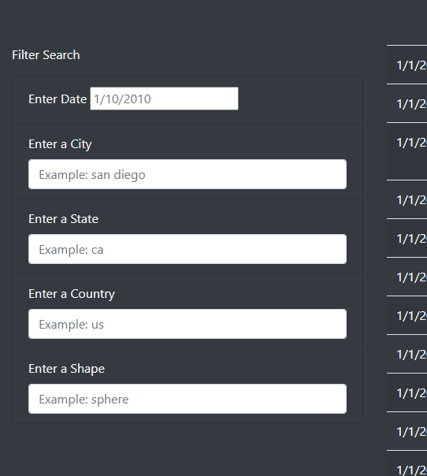
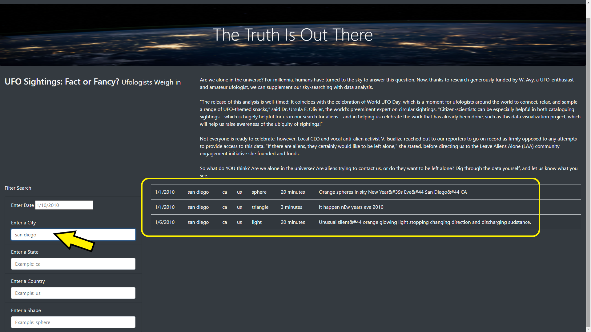
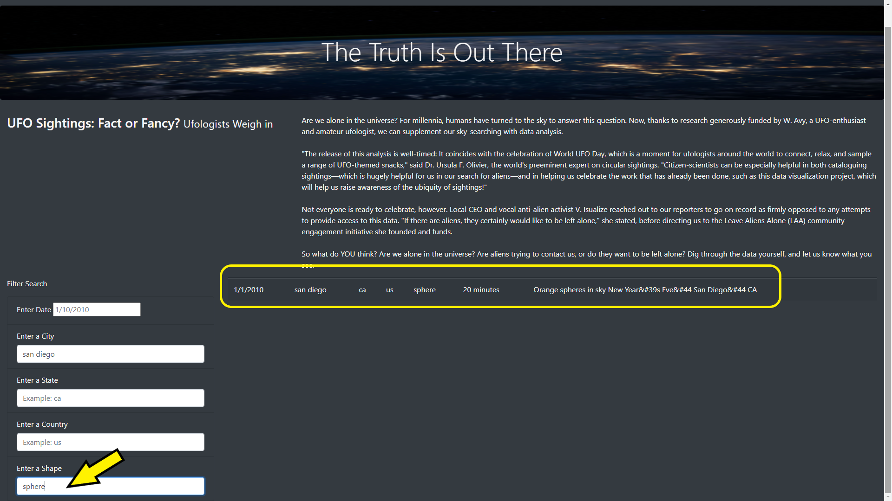

# UFOs

### Summary
The purpose of this project is to build a webpage to visualize UFO data stored in a JavaScript array. We are tasked with creating filters to make this data table fully dynamic, meaning that it will react to user input, and then place the table into an HTML file for easy viewing. We will be utilizing customization on the created webpage using Bootstrap, and equip our table with several fully functional filters that will allow users to interact with our visualizations.

### Results / Instructions
Use the following steps to search for desired UFO criteria:
* Load the webpage using your favorite browser.

* Once loaded, take some time to view the information given and locate the “Filter Search” section of the webpage.

* Under the “Filter Search” section, there are multiple input fields that will automatically filter down the data table to the desired search criteria.

* To perform a filter search begin by typing the required criteria as noted on any of the input fields. For example, query “san diego” within the “City” field.

* Once a query has be typed, press “enter” or “return” on your keyboard and the table should present the request filtered data. In our example, all data regarding the City “san diego” has be returned.

* More filters can be applied. Let’s type an additional query “sphere” under the “Shape” field.

* Pressing enter or return, the data is once again filtered and the data for both “san diego” and “sphere” are returned.

### Summary
To summarize, the webpage works as intended and filtered search results are returned as expected. However, there is one drawback that does hinder the performance of the webpage and makes it slightly cumbersome to operate. That is the filter search fields themselves. For example, to utilize the search fields correctly one must know to always input the exact search phrase (including case-sensitive) or else the search will fail.

To solve this issue, we recommend two solutions. One, allow for searching regardless of case sensitivity. And two, add an auto-complete search list to suggest results based on what the user types and what is available in the data table.

